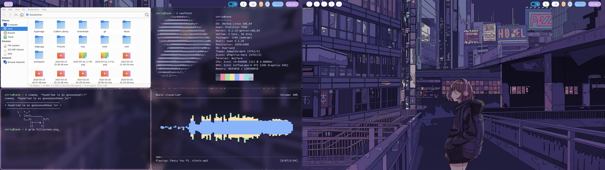
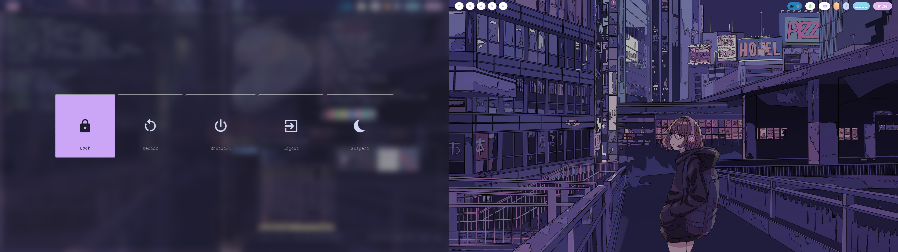
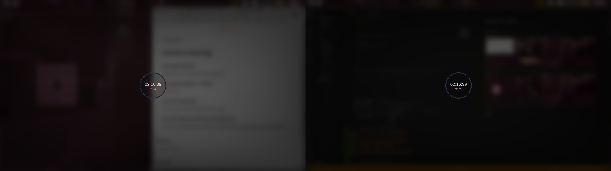

# Hyperland Dotfiles

## screenshot

> fullscreen


> logout menu


> lockscreen



## Notice

> Please do not use the dotfiles of this repository directly, it may cause some conflict in your system, please choose to use it manually.

- OS: [Gentoo Linux](https://www.gentoo.org/) with openrc desktop profile (use the stabe branch, also work on unstable branch)
- WM: [Hyperland](https://github.com/hyprwm/Hyprland/wiki)
- Terminal [Wezterm](https://github.com/wez/wezterm)
- Launcher [Wofi](https://hg.sr.ht/~scoopta/wofi)
- Panel [Waybar](https://aur.archlinux.org/packages/waybar-hyprland-git)


> hyprpaper need manual install

## Software Tables


| | | 
| -- | -- | 
| NAME IN PORTAGE | PURPOSE | 
| media-video/mpv | is the patrician's choice video player. |
| media-gfx/sxiv | is a minimalist image viewer. |
| x11-base/xorg-server | is the graphical server. This first one may take a while as it pulls many other dependencies first on clean installs. |
| x11-misc/sxhkd | is the keybind tools. |
| media-sound/mpd | is a lightweight music daemon. |
| app-misc/ranger | is a terminal file manager. |
| gui-wm/hyprland | is a dynamic tiling Wayland compositor based on wlroots that doesn't sacrifice on its looks. |
| x11-terms/wezterm | A GPU-accelerated cross-platform terminal emulator |
| gui-libs/xdg-desktop-portal-wlr | is xdg-desktop-portal backend for wlroots |
| app-shells/starship | minimal, blazing-fast, and infinitely customizable prompt for any shell. |
| gui-apps/wofi |  is a launcher/menu program for wlroots based wayland compositors such as sway |
| media-video/wireplumber |  is a modular session / policy manager for PipeWire and a GObject-based high-level library that wraps PipeWire's API, providing convenience for writing the daemon's modules as well as external tools for managing PipeWire.| 
| media-sound/ncmpcpp | a ncurses interface for music with multiple formats and a powerful tag editor. |
| gui-apps/grim | Grab images from a Wayland compositor. Works great with slurp and with sway. |
| gui-apps/swaylock-effects | is a fork of swaylock which adds built-in screenshots and image manipulation effects like blurring. It's inspired by i3lock-color, although the feature sets aren't perfectly overlapping. |
| xfce-base/thunar |  is a modern file manager for the Xfce Desktop Environment |
| gui-apps/slurp | Select a region in a Wayland compositor and print it to the standard output. Works well with grim. |
| gui-apps/waybar::useless-overlay | Highly customizable Wayland bar for Sway and Wlroots based compositors. |

## Installation

> Enable wayland support 


Enable `wayland screencast pulseaudio` USE at global (make.conf), then rebuild the system

```shell
emerge --ask --verbose --changed-use --update --deep @world
```

> hyperland and dependence


In this repository I use a set named workspace(This set contains some unnecessary software package, you can decide whether to delete it, But at least the software list of the package is still there), Install this set:

```shell
emerge -av @workspace
```


## Configuration


Just copy each config file in your XDG_CONFIG Folders


# Reference Links

- https://github.com/Alexays/Waybar/wiki/Configuration 
- https://github.com/linuxmobile/hyprland-dots
- https://www.reddit.com/r/hyprland/comments/11tlwjh/gentoo_waybar_clickable_workspaces/
- https://github.com/flick0/dotfiles
- https://wiki.gentoo.org/wiki/Wayland
- https://wiki.gentoo.org/wiki/Wayland_Desktop_Landscape
- https://forums.gentoo.org/viewtopic-t-1150271-start-0.html
- https://github.com/hyprwm/hyprpaper
- https://wiki.gentoo.org/wiki/PulseAudio
- https://github.com/LukeSmithxyz/voidrice/blob/master/.config/shell/profile
